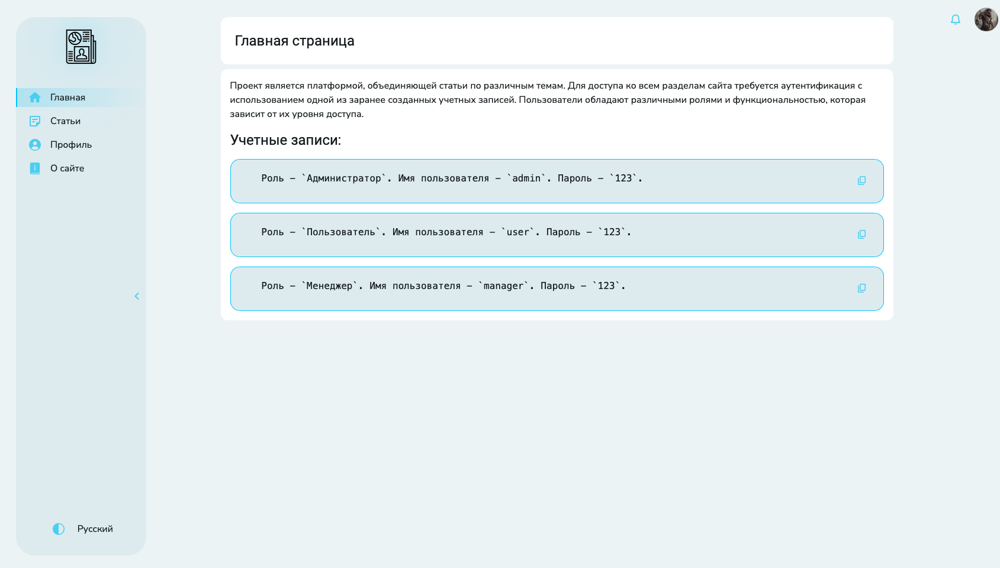
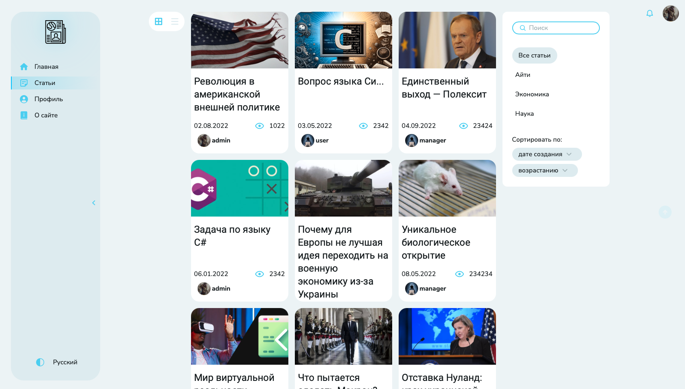
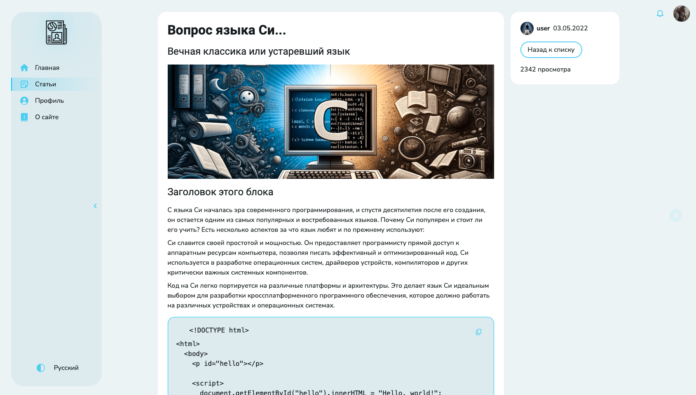
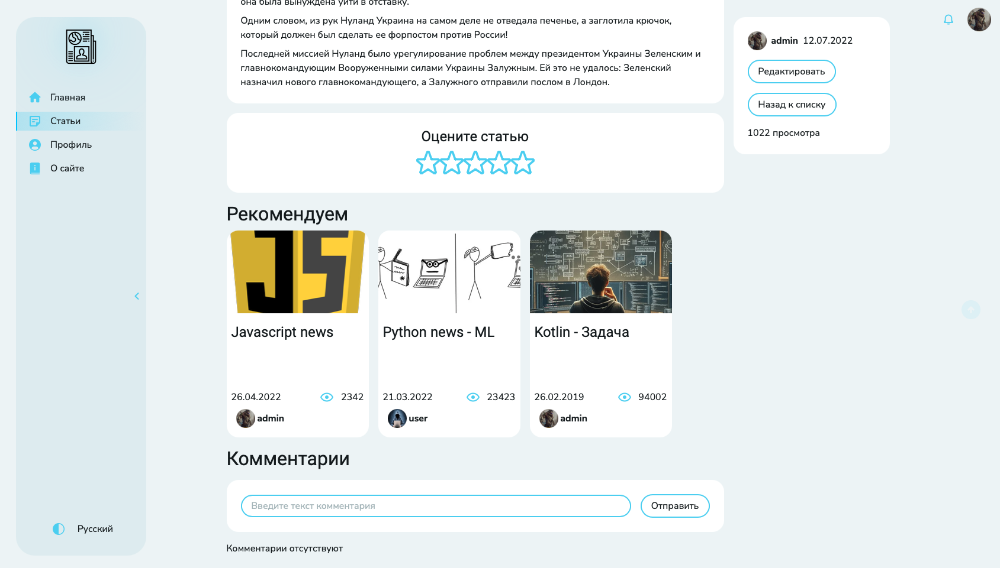
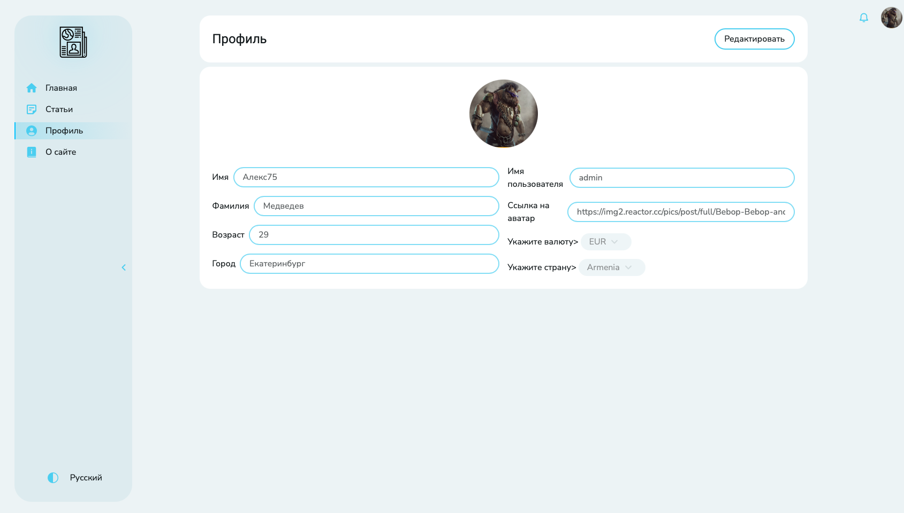
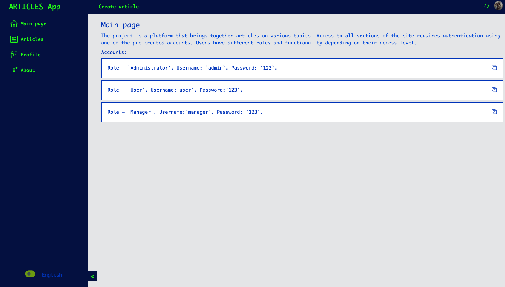
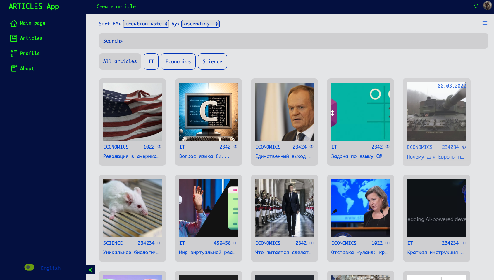

# 🎵 Articles Platform

 
 
 
 
 
 
 
 
 
 
 
 
 
 
 


## 📖 О проекте
**Articles Platform** — это веб-приложение для просмотра и публикации статей, разработанное с помощью **React**, **Vite**, **Webpack**, **Redux** и прочих технолочий. Проект предоставляет собой удобный интерфейс для управления статьями, пользователями и пользовательскими данными. Включает в себе версию с 2 видами дизайна и различными темами оформления. Внедрена поддержка перевода интерфейса на русский и английский языки.

<h4>Новый дизайн:</h4>
<div style="display: flex; flex-wrap: wrap; gap: 16px;">
  <a href="./public/screenshots/new/Main.png" target="_blank">
    
  </a>
  <a href="./public/screenshots/new/Articles.png" target="_blank">
    
  </a>
  <a href="./public/screenshots/new/Article-top.png" target="_blank">
    
  </a>
    <a href="./public/screenshots/new/Article-bottom.png" target="_blank">
    
  </a>
  <a href="./public/screenshots/new/Profile.png" target="_blank">
    
  </a>
</div>
</hr>

<h4>Старый дизайн:</h4>
<div style="display: flex; flex-wrap: wrap; gap: 16px;">
  <a href="./public/screenshots/old/Main.png" target="_blank">
    
  </a>
  <a href="./public/screenshots/old/Articles.png" target="_blank">
    
  </a>
  <a href="./public/screenshots/old/Profile.png" target="_blank">
    
  </a>
</div>


## 📦 Запуск проекта

```
npm install - устанавливаем зависимости
npm run start:dev или npm run start:dev:vite - запуск сервера + frontend проекта в dev режиме
```

----

## 🛠️ Скрипты

- `npm run start` - Запуск frontend проекта на webpack dev server
- `npm run start:vite` - Запуск frontend проекта на vite
- `npm run start:dev` - Запуск frontend проекта на webpack dev server + backend
- `npm run start:dev:vite` - Запуск frontend проекта на vite + backend
- `npm run start:dev:server` - Запуск backend сервера
- `npm run build:prod` - Сборка в prod режиме
- `npm run build:dev` - Сборка в dev режиме (не минимизирован)
- `npm run lint:ts` - Проверка ts файлов линтером
- `npm run lint:ts:fix` - Исправление ts файлов линтером
- `npm run lint:scss` - Проверка scss файлов style линтером
- `npm run lint:scss:fix` - Исправление scss файлов style линтером
- `npm run test:unit` - Хапуск unit тестов с jest
- `npm run test:ui` - Хапуск скриншотных тестов с loki
- `npm run test:ui:ok` - Подтверждение новых скриншотов
- `npm run test:ui:ci` - Запуск скриншотных тестов в CI
- `npm run test:ui:report` - Генерация полного отчета для скриншотных тестов
- `npm run test:ui:json` - Генерация json отчета для скриншотных тестов
- `npm run test:ui:html` - Генерация HTML отчета для скриншотных тестов
- `npm run storybook` - запуск Storybook
- `npm run storybook:build` - Сборка storybook билда
- `npm run prepare` - прекоммит хуки
- `npm run generate:slice` - Скрипт для генерации FSD слайсов

----

## 🚀 Архитектура проекта

Проект написан в соответствии с методологией Feature sliced design

Ссылка на документацию - [feature sliced design](https://feature-sliced.design/docs/get-started/tutorial)

----

## ⌨️️ Работа с переводами

В проекте используется библиотека i18next для работы с переводами.
Файлы с переводами хранятся в public/locales.

Для комфортной работы рекомендуем установить плагин для webstorm/vscode

Документация i18next - [https://react.i18next.com/](https://react.i18next.com/)

----

## 🧪 Тесты

В проекте используются 4 вида тестов:
1) Обычные unit тесты на jest - `npm run test:unit`
2) Тесты на компоненты с React testing library -`npm run test:unit`
3) Скриншотное тестирование с loki `npm run test:ui`
4) e2e тестирование с Cypress `npm run test:e2e`

Подробнее о тестах - [документация тестирование](/docs/tests.md)

----

## 🧹 Линтинг

В проекте используется eslint для проверки typescript кода и stylelint для проверки файлов со стилями.

Также для строгого контроля главных архитектурных принципов
используется собственный eslint plugin *eslint-plugin-mspolermo-plugin*,
который содержит 3 правила
1) path-checker - запрещает использовать абсолютные импорты в рамках одного модуля
2) layer-imports - проверяет корректность использования слоев с точки зрения FSD
   (например widgets нельзя использовать в features и entitites)
3) public-api-imports - разрешает импорт из других модулей только из public api. Имеет auto fix

##### Запуск линтеров
- `npm run lint:ts` - Проверка ts файлов линтером
- `npm run lint:ts:fix` - Исправление ts файлов линтером
- `npm run lint:scss` - Проверка scss файлов style линтером
- `npm run lint:scss:fix` - Исправление scss файлов style линтером

----
## 📖 Storybook

В проекте для каждого компонента описываются стори-кейсы.
Запросы на сервер мокаются с помощью storybook-addon-mock.

Файл со сторикейсами создает рядом с компонентом с расширением .stories.tsx

Запустить сторибук можно командой:
- `npm run storybook`

Подробнее о [Storybook](/docs/storybook.md)

Пример:

```typescript jsx
import React from 'react';
import { ComponentStory, ComponentMeta } from '@storybook/react';

import { ThemeDecorator } from '@/shared/config/storybook/ThemeDecorator/ThemeDecorator';
import { Button, ButtonSize, ButtonTheme } from './Button';
import { Theme } from '@/shared/const/theme';

export default {
    title: 'shared/Button',
    component: Button,
    argTypes: {
        backgroundColor: { control: 'color' },
    },
} as ComponentMeta<typeof Button>;

const Template: ComponentStory<typeof Button> = (args) => <Button {...args} />;

export const Primary = Template.bind({});
Primary.args = {
    children: 'Text',
};

export const Clear = Template.bind({});
Clear.args = {
    children: 'Text',
    theme: ButtonTheme.CLEAR,
};
```


----

## 💻 Конфигурация проекта

Для разработки проект содержит 2 конфига:
1. Webpack - ./config/build
2. vite - vite.config.ts

Оба сборщика адаптированы под основные фичи приложения.

Вся конфигурация хранится в /config
- /config/babel - babel
- /config/build - конфигурация webpack
- /config/jest - конфигурация тестовой среды
- /config/storybook - конфигурация сторибука

В папке `scripts` находятся различные скрипты для рефакторинга\упрощения написания кода\генерации отчетов и тд.

----

## ⏱️ CI pipeline и pre commit хуки

Конфигурация github actions находится в /.github/workflows.
В ci прогоняются все виды тестов, сборка проекта, линтинг.
После прохождения тестов, формируется отчет для ghPages, доступный по адресу:
[htmlReport](https://mspolermo.github.io/production-project/)

В прекоммит хуках проверяем проект линтерами, конфиг в /.husky

----

### 🪪 Работа с данными

Взаимодействие с данными осуществляется с помощью redux toolkit.
По возможности переиспользуемые сущности необходимо нормализовать с помощью EntityAdapter

Запросы на сервер отправляются с помощью [RTK query](/src/shared/api/rtkApi.ts)

Для асинхронного подключения редюсеров (чтобы не тянуть их в общий бандл) используется
[DynamicModuleLoader](/src/shared/lib/components/DynamicModuleLoader/DynamicModuleLoader.tsx)

----

### 🔧 Работа с feature-flags

Разрешено использование feature flags только с помощью хелпера toggleFeatures

в него передается объект с опциями 

{
   name: название фича-флага, 
   on: функция, которая отработает после Включения фичи 
   of: функция, которая отработает после ВЫключения фичи
}

Для автоматического удаления фичи использовать скрипт remove-feature.ts,
который принимает 2 аргумента
1. Название удаляемого фича-флага
2. Состояние (on\off)

----

## 🔑 Сущности (entities)

- [Article](/src/entities/Article/README.md)
- [Comment](/src/entities/Comment/README.md)
- [Counter](/src/entities/Counter/README.md)
- [Country](/src/entities/Country/README.md)
- [Currency](/src/entities/Currency/README.md)
- [Notification](/src/entities/Notification/README.md)
- [Profile](/src/entities/Profile/README.md)
- [Rating](/src/entities/Rating/README.md)
- [User](/src/entities/User/README.md)

## 🛒 Фичи (features)

- [addCommentForm](/src/features/addCommentForm/README.md)
- [articleEditForm](/src/features/articleEditForm/README.md)
- [articlePageGreeting](/src//features/articlePageGreeting/README.md)
- [articleRating](/src/features/articleRating/README.md)
- [articleRecommendationsList](/src/features/articleRecommendationsList/README.md)
- [ArticleSortSelector](/src/features/ArticleSortSelector/README.md)
- [ArticleTypeTabs](/src/features/ArticleTypeTabs/README.md)
- [ArticleViewSelector](/src/features/ArticleViewSelector/README.md)
- [AuthByUsername](/src/features/AuthByUsername/README.md)
- [avatarDropdown](/src/features/avatarDropdown/README.md)
- [editableProfileCard](/src/features/editableProfileCard/README.md)
- [LangSwitcher](/src/features/LangSwitcher/README.md)
- [notificationButton](/src/features/notificationButton/README.md)
- [scrollToTopButton](/src/features/scrollToTopButton/README.md)
- [profileRating](/src/features/profileRating)
- [ThemeSwitcher](/src/features/ThemeSwitcher/README.md)
- [UI](/src/features/UI/README.md)
- [uiDesignSwitcher](/src/features/uiDesignSwitcher/README.md)

## 📂 Виджеты (widgets)

- [ArticleAdditionalInfo](/src/widgets/ArticleAdditionalInfo/README.md)
- [ArticlesFiltres](/src/widgets/ArticlesFilters/README.md)
- [ErrorPage](/src/widgets/ErrorPage/)
- [Navbar](/src/widgets/Navbar/README.md)
- [Page](/src/widgets/Page/README.md)
- [PageLoader](/src/widgets/PageLoader/README.md)
- [ScrollToolbar](/src/widgets/ScrollToolbar/README.md)
- [Sidebar](/src/widgets/Sidebar/README.md)

## 🔖 Страницы (pages)

- [AboutPage](/src/pages/AboutPage/README.md)
- [AdminPanelPage](/src/pages/AdminPanelPage/README.md)
- [ArticleDetailsPage](/src/pages/ArticleDetailsPage/README.md)
- [ArticleEditPage](/src/pages/ArticleEditPage/README.md)
- [ArticlesPage](/src/pages/ArticlesPage/README.md)
- [ForbiddenPage](/src/pages/ForbiddenPage/README.md)
- [MainPage](/src/pages/MainPage/READMe.md)
- [NotFoundPage](/src/pages/NotFoundPage/README.md)
- [ProfilePage](/src/pages/ProfilePage/README.md)
- [SettingsPage](/src/pages/SettingsPage/README.md)

----

## 📎 Дополнительная информация

Фронтенд задеплоен на [Netlify](https://fluffy-semifreddo-7d715d.netlify.app)

Фейковый бэкенд задеплоен на [Vercel](https://production-project-server-fo5jn5h1d-mspolermos-projects.vercel.app/)

